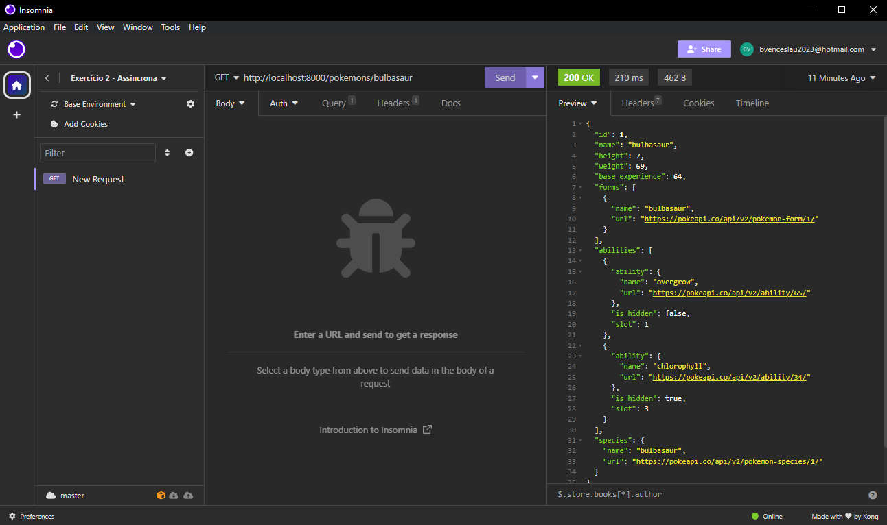

# API - Pokemon

### Essa aplicação serve para mostrar uma página expecífica de pokemons da Pokédex, ou monstrar detalhes de um pokémon especifico, usando como parâmetro o seu id ou nome.

# Como rodar o projeto
### Para rodar o projeto localmente você precisa:

- Executar no terminal Node.js:
    
    1. Instalar o pacote npm
        
            npm install

    2. Inicializar o servidor

            npm run dev 

- Executar no navegador ou em um programa:

    1. Listar os pokemons da primeira página ou de uma página específica da Pokédex

            http://localhost:8000/pokemons

            http://localhost:8000/pokemons?pagina=2

    2. Detalhar um pokemon específico através de Id ou nome

            http://localhost:8000/pokedex/1
            
            http://localhost:8000/podekex/bulbasaur

## Tecnologias usadas:

- JavaScript

- Node.js

- Npm

- JSON